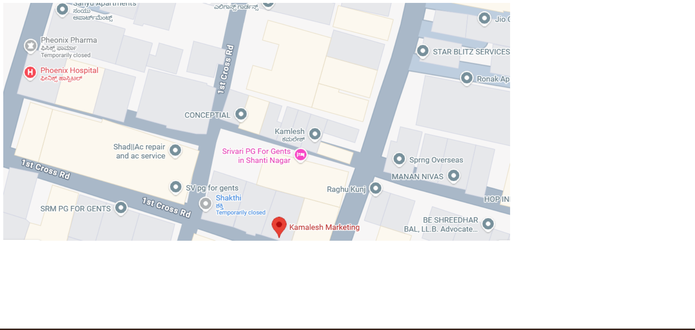
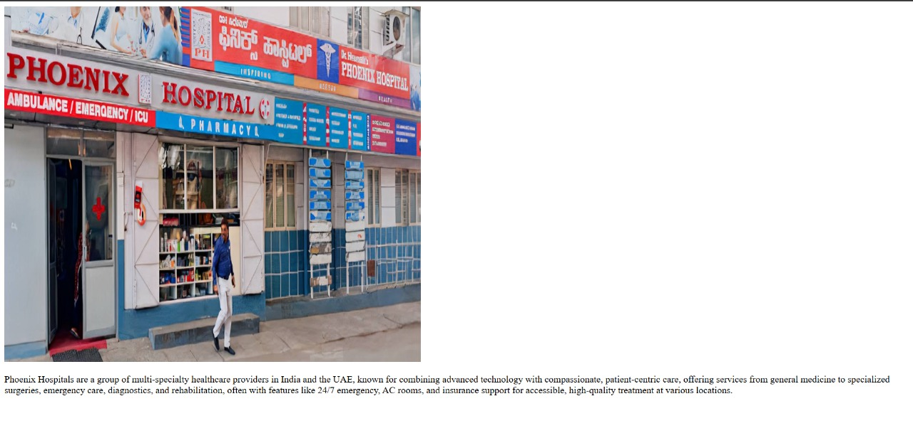

# Ex03 Places Around Me
## Date: 12.12.25

## AIM
To develop a website to display details about the places around my house.

## DESIGN STEPS

### STEP 1
Create a Django admin interface.

### STEP 2
Download your city map from Google as an image.

### STEP 3
Insert the image using `````` tag and link it to the map.

### STEP 4
Using ```<map>``` tag name the map.

### STEP 5
Create clickable regions in the image using ```<area>``` tag.

### STEP 6
Write HTML programs for all the regions identified.

### STEP 7
Execute the programs and publish them.

## CODE
```
web.html
<!DOCTYPE html>
<html lang="en">
<head>
    <meta charset="UTF-8">
    <meta name="viewport" content="width=device-width, initial-scale=1.0">
    <title>Document</title>
</head>
<body>
        <!-- Image Map Generated by http://www.image-map.net/ -->
    

    <map name="image-map">
        <area target="" alt="marketing.html" title="marketing.html" href="KAMALESH" coords="796,525,587,455" shape="rect">
        <area target="" alt="street.html" title="street.html" href="STREET" coords="783,394,58" shape="circle">
        <area target="" alt="hospital.html" title="hospital.html" href="HOSPITAL" coords="30,129,218,177" shape="rect">
    </map>
    
</body>
</html>
hospital.html
<!DOCTYPE html>
<html lang="en">
<head>
    <meta charset="UTF-8">
    <meta name="viewport" content="width=device-width, initial-scale=1.0">
    <title>Document</title>
</head>
<body>
    
    <p>Phoenix Hospitals are a group of multi-specialty healthcare providers in India and the UAE, known for combining advanced technology with compassionate, patient-centric care, offering services from general medicine to specialized surgeries, emergency care, diagnostics, and rehabilitation, often with features like 24/7 emergency, AC rooms, and insurance support for accessible, high-quality treatment at various locations. </p>
</body>
</html>
marketing.html
<!DOCTYPE html>
<html lang="en">
<head>
    <meta charset="UTF-8">
    <meta name="viewport" content="width=device-width, initial-scale=1.0">
    <title>Document</title>
</head>
<body>
     
    <p>a Bengaluru-based wholesaler of home appliances (fans, heaters, mixers) since 1990, and several digital marketing professionals like Kamlesh Kumar, Kamalesh Jayasanker, or Kamalesh Arvind, who offer services in SEO, social media, ads, and content strategy for brand growth. To get the right description, you need to specify if you mean the appliance trader or a digital marketer. </p>
</body>
</html>
street.html
<!DOCTYPE html>
<html lang="en">
<head>
    <meta charset="UTF-8">
    <meta name="viewport" content="width=device-width, initial-scale=1.0">
    <title>Document</title>
</head>
<body>
     
    <p>Rahul street</p>
</body>
</html>
```
## OUTPUT





## RESULT
The program for implementing image maps using HTML is executed successfully.
